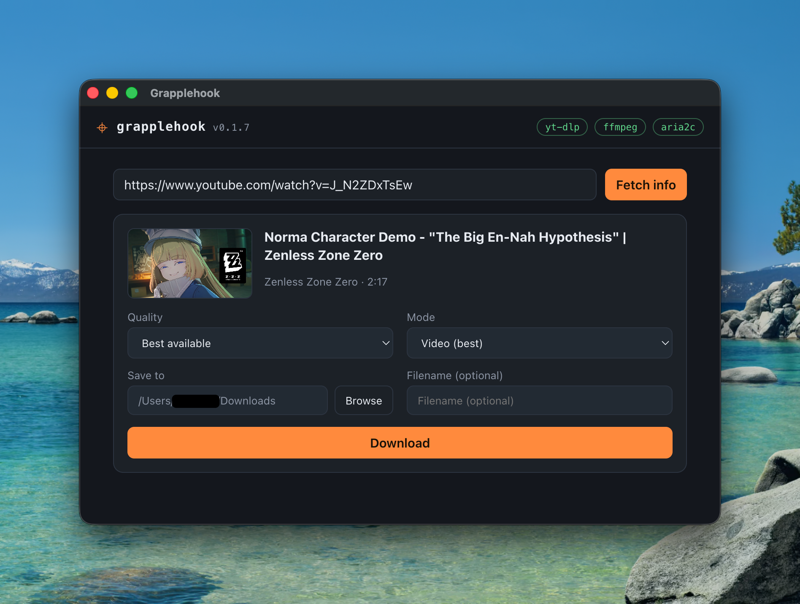

# grapplehook-ui

Desktop GUI for **grapplehook**, built with Electron on top of
[`grapplehook-core`](https://www.npmjs.com/package/grapplehook-core) (there's
also a [CLI](https://github.com/rusty-grapplehook/grapplehook-cli) if you live
in a terminal). Paste a URL, pick a quality, and download - with a live
progress bar (download _and_ transcode stages), cancellation, and a
tool-availability readout for `yt-dlp` / `ffmpeg` / `aria2c`.



> Downloading YouTube content is governed by YouTube's Terms of Service and by
> copyright law. Use this only for videos you have the right to download.

## Install

Grab the installer for your platform from the
[latest release](https://github.com/rusty-grapplehook/grapplehook-ui/releases/latest):
`.dmg` (macOS, Apple Silicon), `.exe` (Windows), or `.AppImage` (Linux).

The builds are **not code-signed** (i aint paying 200$/yr for this shi lol), so each
OS shows a one-time warning the first time you run the app. That's expected -
here's how to get past it. If you'd rather not trust an unsigned binary, you
can always [build from source](#develop) instead.

### macOS

Gatekeeper will refuse to open the app with _"Grapplehook" cannot be opened
because Apple cannot check it for malicious software_ (or _"the developer
cannot be verified"_).

1. Open the `.dmg` and drag **Grapplehook** into **Applications** as usual.
2. Try to open it once (it will be blocked - that's fine).
3. Go to **System Settings → Privacy & Security**, scroll down, and click
   **Open Anyway** next to the Grapplehook message, then confirm.

On older macOS versions, right-clicking the app in Applications and choosing
**Open** (twice, if needed) works too. Either way it's a one-time step; after
that it opens normally.

If macOS instead says the app _"is damaged and can't be opened"_, that's
Gatekeeper's quarantine flag on an unsigned download - clear it with:

```bash
xattr -cr /Applications/Grapplehook.app
```

The `.dmg` is Apple Silicon only. On an Intel Mac, [build from
source](#develop) instead - `pnpm run dist` produces an x64 build on x64
hardware.

### Windows

SmartScreen shows a blue **"Windows protected your PC"** dialog when you run
the installer.

1. Click **More info**.
2. Click **Run anyway**.

The installer then runs normally. Your browser may also flag the download
itself - choose **Keep** / **Keep anyway** in the download bar.

### Linux

No signing involved - AppImages just need to be executable:

```bash
chmod +x grapplehook-ui-*.AppImage
./grapplehook-ui-*.AppImage
```

If it fails with a FUSE error on newer distros (Ubuntu 24.04+), install
`libfuse2` (e.g. `sudo apt install libfuse2t64`) or run it with
`--appimage-extract-and-run`.

### Verify your download (optional)

Every release asset has its SHA-256 digest listed on the release page. To
check that your download matches:

```bash
shasum -a 256 <file>        # macOS
sha256sum <file>            # Linux
certutil -hashfile <file> SHA256   # Windows
```

Remember the app still needs `yt-dlp` and `ffmpeg` installed - see
[Requirements](#requirements).

## Usage

1. **Check the pills.** The header shows live availability for `yt-dlp`,
   `ffmpeg`, and `aria2c`. Red pill = not found - see
   [Requirements](#requirements).
2. **Paste a URL.** The video's title, duration, and available resolutions
   load automatically.
3. **Pick your options.** Choose a max quality, toggle **mp4** if you need an
   editor-friendly H.264/AAC file (this re-encodes, so it's slower), and
   optionally set a custom filename.
4. **Choose where it goes.** Defaults to your OS Downloads folder; the folder
   picker changes it per download.
5. **Download.** The progress bar covers both stages - download, then
   transcode if mp4 is on. Multiple downloads can run at once, each with its
   own cancel button, and quitting the app cancels anything still running (no
   orphaned processes).

When a download finishes, click its entry to reveal the file in your file
manager.

## Layout

```text
grapplehook-ui/
├── package.json
├── tsconfig.json            # compiles src/main + src/preload → dist (CJS)
├── scripts/
│   └── copy-renderer.mjs    # copies src/renderer → dist/renderer
└── src/
    ├── main/main.ts         # window + IPC handlers wrapping grapplehook-core
    ├── main/update-check.ts # queries GitHub releases for a newer version
    ├── preload/preload.ts   # contextBridge: window.grapplehook API
    └── renderer/            # static UI (index.html / style.css / renderer.js)
```

Everything that spawns subprocesses runs in the **main process** (that's where
`grapplehook-core` lives). The renderer is fully sandboxed
(`contextIsolation: true`, `nodeIntegration: false`, `sandbox: true`) and talks
to main only through the small API the preload exposes:

| Renderer call                             | IPC channel                          | Backed by                                       |
| ----------------------------------------- | ------------------------------------ | ----------------------------------------------- |
| `grapplehook.checkTools()`                | `gh:checkTools`                      | `checkTools()`                                  |
| `grapplehook.getInfo(url)`                | `gh:getInfo`                         | `getVideoInfo(url)`                             |
| `grapplehook.getAppInfo()`                | `gh:getAppInfo`                      | `app.getVersion()` + `app.getPath('downloads')` |
| `grapplehook.chooseDir()`                 | `gh:chooseDir`                       | `dialog.showOpenDialog()`                       |
| `grapplehook.openPath(path)`              | `gh:openPath`                        | `shell.showItemInFolder()`                      |
| `grapplehook.start(opts)` → `taskId`      | `gh:start`                           | `download(opts)`                                |
| `grapplehook.cancel(taskId)`              | `gh:cancel`                          | `task.cancel()`                                 |
| `grapplehook.checkUpdate()`               | `gh:checkUpdate`                     | GitHub releases API                             |
| `grapplehook.openReleases()`              | `gh:openReleases`                    | `shell.openExternal()`                          |
| `grapplehook.onProgress/onLog/onDone(cb)` | `gh:progress` / `gh:log` / `gh:done` | task events                                     |

Multiple downloads can run at once; each is identified by a `taskId` so the
progress stream and cancel button target the right one. `before-quit` cancels
any running tasks so no orphaned yt-dlp/ffmpeg processes are left behind.

## Requirements

Same external tools as the CLI - they are **not** bundled with the app:

- `yt-dlp` on `PATH` (or `YTDLP_PATH`)
- `ffmpeg` / `ffprobe` on `PATH` (or `FFMPEG_PATH` / `FFPROBE_PATH`)
- `aria2c` recommended (or `ARIA2C_PATH`) - auto-used when present for much
  faster downloads

The header pills show live availability at launch. Node.js 24+ and
[pnpm](https://pnpm.io) are only needed if you're [building from
source](#develop).

### Installing the tools

**macOS** ([Homebrew](https://brew.sh)):

```bash
brew install yt-dlp ffmpeg aria2
```

**Windows** (winget, built into Windows 10/11 - or use `choco` / `scoop`
equivalents):

```powershell
winget install yt-dlp.yt-dlp
winget install Gyan.FFmpeg
winget install aria2.aria2
```

Restart the app (or your terminal) afterwards so the updated `PATH` is picked
up.

**Linux:**

```bash
# Debian / Ubuntu
sudo apt install ffmpeg aria2
# Fedora            sudo dnf install ffmpeg aria2
# Arch              sudo pacman -S ffmpeg aria2
```

Distro repos often ship an outdated `yt-dlp`, which is the #1 source of
breakage - install it via pipx (or download the [official
binary](https://github.com/yt-dlp/yt-dlp#installation)) instead:

```bash
pipx install yt-dlp
```

**Keep yt-dlp updated** - YouTube changes frequently and most download
failures are fixed by:

```bash
yt-dlp -U        # or: pipx upgrade yt-dlp / brew upgrade yt-dlp / winget upgrade yt-dlp.yt-dlp
```

If a tool is installed somewhere unusual, point the app at it with the
`YTDLP_PATH` / `FFMPEG_PATH` / `FFPROBE_PATH` / `ARIA2C_PATH` environment
variables.

## Troubleshooting

- **Downloads suddenly fail / "unable to extract" errors** - YouTube changed
  something and your `yt-dlp` is stale. This is the #1 cause of breakage:

  ```bash
  yt-dlp -U   # or: pipx upgrade yt-dlp / brew upgrade yt-dlp / winget upgrade yt-dlp.yt-dlp
  ```

- **A pill is red but the tool is installed** - it's not on the `PATH` the app
  sees, or it's somewhere unusual. Point the app at it with `YTDLP_PATH` /
  `FFMPEG_PATH` / `FFPROBE_PATH` / `ARIA2C_PATH`, then restart the app.
- **macOS says the app "is damaged"** - Gatekeeper quarantine flag on the
  unsigned download: `xattr -cr /Applications/Grapplehook.app`
  (see [Install → macOS](#macos)).
- **AppImage won't start (FUSE error)** - `sudo apt install libfuse2t64` or
  run with `--appimage-extract-and-run` (see [Install → Linux](#linux)).
- **Downloads are slow** - install `aria2c`; the app auto-uses it when
  present.

## Develop

`grapplehook-core` is a regular npm dependency, so setup is a single install:

```bash
pnpm install
pnpm start           # build + launch
pnpm run dev         # build + launch with DevTools open
```

Other scripts:

```bash
pnpm run typecheck   # tsc --noEmit
pnpm run bonita      # lint --fix + prettier --write
```

> Hacking on core at the same time? Link a local checkout with
> `pnpm link ../grapplehook-core` (and run its `dev`/`build` there), then
> `pnpm unlink grapplehook-core` to go back to the published package.

## Package

```bash
pnpm run dist        # electron-builder → ./release (dmg / nsis / AppImage)
```

### Bundling the binaries (optional)

To ship yt-dlp/ffmpeg inside the app instead of requiring them on `PATH`:

1. Add the binaries under `resources/bin/` and list them in the
   `build.extraResources` field of `package.json`.
2. In `main.ts`, pass explicit paths to every core call:

```ts
import { app } from 'electron';
import path from 'node:path';

const bin = (name: string) => path.join(process.resourcesPath, 'bin', process.platform === 'win32' ? `${name}.exe` : name);

const config = app.isPackaged ? { tools: { ytDlp: bin('yt-dlp'), ffmpeg: bin('ffmpeg'), ffprobe: bin('ffprobe'), aria2c: bin('aria2c') } } : {};

// then: getVideoInfo(url, config) / download(opts, config) / checkTools(config)
```

## Notes

- The header shows the app version next to the wordmark, and the output
  folder defaults to the OS Downloads directory (`app.getPath('downloads')`) -
  changeable per download via the folder picker.
- On launch the app checks GitHub for a newer release (one anonymous request
  to the releases API).

## Contributing

Bugs and feature requests → [GitHub
issues](https://github.com/rusty-grapplehook/grapplehook-ui/issues). PRs
welcome - run `pnpm run bonita` before pushing so lint/format stay clean.

## License

[MIT](LICENSE)
